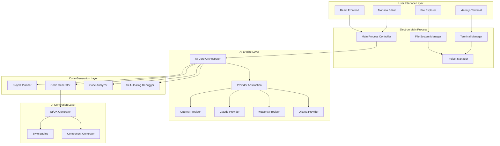
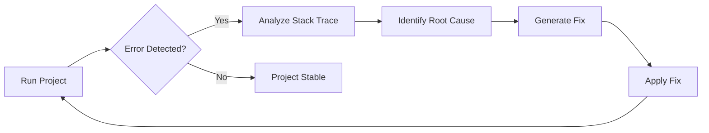
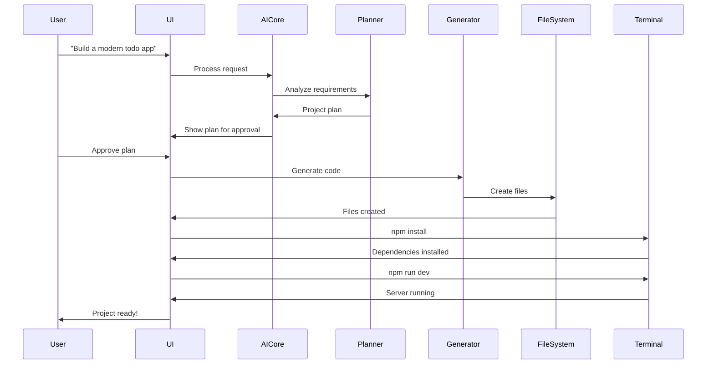

# Orix-AI Architecture & Implementation Plan

## 🎯 Project Overview

**Orix-AI** is an AI-native autonomous development environment built with Electron, TypeScript, and React. It transforms user ideas into fully working software projects through intelligent planning, multi-file code generation, self-healing debugging workflows, and professional UI/UX design.

---

## 📚 Technology Stack

### Core Technologies
- **Desktop Framework**: Electron (latest stable)
- **Frontend**: React 18+ with TypeScript
- **Build Tool**: Vite
- **Package Manager**: pnpm
- **State Management**: Zustand
- **Styling**: TailwindCSS + shadcn/ui
- **Code Editor**: Monaco Editor
- **Terminal**: xterm.js
- **Testing**: Vitest + React Testing Library

### AI Integration
- **Multi-Provider Support**: OpenAI, Anthropic Claude, IBM watsonx, Ollama
- **Provider Abstraction**: Unified interface for all AI providers
- **Streaming Support**: Real-time code generation feedback

---

## 🏗️ System Architecture



---

## 📁 Project Structure

```
orix-ai/
├── electron/                    # Electron main process
│   ├── main.ts                 # Entry point
│   ├── preload.ts              # Preload script
│   ├── managers/               # System managers
│   │   ├── FileSystemManager.ts
│   │   ├── TerminalManager.ts
│   │   ├── ProjectManager.ts
│   │   └── WindowManager.ts
│   └── ipc/                    # IPC handlers
│       ├── fileHandlers.ts
│       ├── terminalHandlers.ts
│       └── projectHandlers.ts
│
├── src/                        # React frontend
│   ├── main.tsx               # React entry point
│   ├── App.tsx                # Main app component
│   ├── components/            # React components
│   │   ├── Editor/
│   │   │   ├── CodeEditor.tsx
│   │   │   └── EditorTabs.tsx
│   │   ├── FileExplorer/
│   │   │   ├── FileTree.tsx
│   │   │   └── FileItem.tsx
│   │   ├── Terminal/
│   │   │   └── Terminal.tsx
│   │   ├── Chat/
│   │   │   ├── ChatInterface.tsx
│   │   │   └── MessageList.tsx
│   │   └── Layout/
│   │       ├── Sidebar.tsx
│   │       ├── MainPanel.tsx
│   │       └── StatusBar.tsx
│   │
│   ├── stores/                # State management
│   │   ├── useProjectStore.ts
│   │   ├── useEditorStore.ts
│   │   ├── useTerminalStore.ts
│   │   └── useAIStore.ts
│   │
│   ├── services/              # Business logic
│   │   ├── ipc/              # IPC communication
│   │   │   ├── fileService.ts
│   │   │   ├── terminalService.ts
│   │   │   └── projectService.ts
│   │   └── ai/               # AI services
│   │       ├── AIOrchestrator.ts
│   │       └── providers/
│   │
│   ├── hooks/                 # Custom React hooks
│   │   ├── useFileSystem.ts
│   │   ├── useTerminal.ts
│   │   └── useAI.ts
│   │
│   ├── types/                 # TypeScript types
│   │   ├── project.ts
│   │   ├── ai.ts
│   │   └── editor.ts
│   │
│   └── utils/                 # Utility functions
│       ├── fileUtils.ts
│       ├── pathUtils.ts
│       └── codeUtils.ts
│
├── core/                      # Core AI engine (shared)
│   ├── ai/                   # AI provider abstraction
│   │   ├── AIProvider.ts     # Base interface
│   │   ├── ProviderFactory.ts
│   │   └── providers/
│   │       ├── OpenAIProvider.ts
│   │       ├── ClaudeProvider.ts
│   │       ├── WatsonxProvider.ts
│   │       └── OllamaProvider.ts
│   │
│   ├── planner/              # Project planning
│   │   ├── ProjectPlanner.ts
│   │   ├── ArchitectureAnalyzer.ts
│   │   └── TechStackSelector.ts
│   │
│   ├── generator/            # Code generation
│   │   ├── CodeGenerator.ts
│   │   ├── FileGenerator.ts
│   │   ├── ComponentGenerator.ts
│   │   └── templates/
│   │
│   ├── analyzer/             # Code analysis
│   │   ├── CodeAnalyzer.ts
│   │   ├── DependencyAnalyzer.ts
│   │   └── ErrorDetector.ts
│   │
│   ├── debugger/             # Self-healing debugger
│   │   ├── DebugWorkflow.ts
│   │   ├── ErrorAnalyzer.ts
│   │   └── CodeFixer.ts
│   │
│   └── ui-generator/         # UI/UX generation
│       ├── UIGenerator.ts
│       ├── StyleEngine.ts
│       ├── ComponentMapper.ts
│       └── themes/
│
├── tests/                     # Test files
│   ├── unit/
│   ├── integration/
│   └── e2e/
│
├── docs/                      # Documentation
│   ├── API.md
│   ├── CONTRIBUTING.md
│   └── USER_GUIDE.md
│
├── package.json
├── tsconfig.json
├── vite.config.ts
├── electron-builder.json
└── README.md
```

---

## 🔧 Core Components Breakdown

### 1. AI Provider Abstraction Layer

**Purpose**: Unified interface for multiple AI providers

**Key Classes**:

```typescript
// Base interface all providers implement
interface AIProvider {
  name: string;
  initialize(config: ProviderConfig): Promise<void>;
  generateCode(prompt: string, context: CodeContext): Promise<CodeResponse>;
  analyzeCode(code: string): Promise<AnalysisResult>;
  streamResponse(prompt: string): AsyncGenerator<string>;
  validateConfig(): boolean;
}

// Provider factory for dynamic provider selection
class ProviderFactory {
  static createProvider(type: ProviderType, config: ProviderConfig): AIProvider;
  static getAvailableProviders(): ProviderType[];
}
```

**Supported Providers**:
- OpenAI (GPT-4, GPT-4-turbo)
- Anthropic Claude (Claude 3 Opus, Sonnet)
- IBM watsonx
- Ollama (local LLMs)

---

### 2. Project Planner

**Purpose**: Analyze user requirements and create project architecture

**Workflow**:
1. Parse user input
2. Identify project type (web app, API, desktop app, etc.)
3. Determine required features
4. Select optimal tech stack
5. Design folder structure
6. Plan file dependencies
7. Generate implementation roadmap

**Output**: Structured project plan with:
- Architecture diagram
- File structure
- Tech stack recommendations
- Implementation phases
- Dependency list

---

### 3. Code Generator

**Purpose**: Generate multi-file, production-ready code

**Features**:
- Multi-file generation in single pass
- Template-based generation
- Context-aware code completion
- Dependency management
- Import optimization
- Code formatting

**Generation Modes**:
- **Full Project**: Complete project from scratch
- **Feature Addition**: Add new features to existing project
- **Component Generation**: Generate specific components
- **API Generation**: Create REST/GraphQL APIs
- **Database Schema**: Generate database models

---

### 4. Code Analyzer

**Purpose**: Understand existing codebases

**Capabilities**:
- AST parsing
- Dependency graph generation
- Architecture detection
- Framework identification
- Code quality analysis
- Security vulnerability detection
- Performance bottleneck identification

---

### 5. Self-Healing Debugger

**Purpose**: Automatically detect and fix errors

**Workflow**:


**Error Handling**:
- Syntax errors
- Runtime errors
- Build errors
- Dependency conflicts
- Type errors
- Logic errors

---

### 6. UI/UX Generator

**Purpose**: Create professional, modern interfaces

**Design System**:
- Component library (buttons, forms, cards, etc.)
- Color palette generator
- Typography system
- Spacing/layout system
- Animation presets
- Responsive breakpoints

**Supported Styles**:
- Professional
- Futuristic
- Minimal
- Elegant
- Dark mode
- Glassmorphism
- Cyberpunk

**Output**:
- React components
- TailwindCSS classes
- CSS modules
- Styled components
- Animation definitions

---

### 7. File System Manager

**Purpose**: Handle all file operations safely

**Operations**:
- Create/read/update/delete files
- Directory management
- File watching
- Path resolution
- Permission handling
- Backup/restore

**Security**:
- Sandboxed operations
- Path validation
- Permission checks
- Atomic writes

---

### 8. Terminal Manager

**Purpose**: Execute commands and manage processes

**Features**:
- Multiple terminal instances
- Command execution
- Process management
- Output streaming
- Environment variables
- Working directory management

**Supported Shells**:
- PowerShell (Windows)
- Bash (Linux/Mac)
- Zsh (Mac)
- CMD (Windows fallback)

---

### 9. Project Manager

**Purpose**: Manage project lifecycle

**Responsibilities**:
- Project initialization
- Dependency installation
- Build process management
- Development server management
- Project configuration
- Version control integration

---

## 🎨 User Interface Design

### Layout Structure

```
┌─────────────────────────────────────────────────────────┐
│  Orix-AI                                    [- □ ×]     │
├─────────────────────────────────────────────────────────┤
│                                                          │
│  ┌──────┬──────────────────────────────────────────┐   │
│  │      │                                           │   │
│  │ File │  Editor Area                              │   │
│  │ Tree │  ┌─────────────────────────────────────┐ │   │
│  │      │  │ file.tsx                    [×]     │ │   │
│  │ 📁   │  ├─────────────────────────────────────┤ │   │
│  │ src  │  │                                      │ │   │
│  │  📄  │  │  Code Editor (Monaco)                │ │   │
│  │      │  │                                      │ │   │
│  │      │  │                                      │ │   │
│  │      │  └─────────────────────────────────────┘ │   │
│  │      │                                           │   │
│  │      │  Terminal                                 │   │
│  │      │  ┌─────────────────────────────────────┐ │   │
│  │      │  │ $ npm run dev                       │ │   │
│  │      │  │ > Starting dev server...            │ │   │
│  │      │  └─────────────────────────────────────┘ │   │
│  └──────┴──────────────────────────────────────────┘   │
│                                                          │
│  ┌────────────────────────────────────────────────────┐ │
│  │ 🤖 AI Assistant                                    │ │
│  │ ┌────────────────────────────────────────────────┐ │ │
│  │ │ User: Build a todo app                         │ │ │
│  │ │ Orix: Analyzing requirements...                │ │ │
│  │ └────────────────────────────────────────────────┘ │ │
│  │ [Type your message...]                      [Send] │ │
│  └────────────────────────────────────────────────────┘ │
│                                                          │
├─────────────────────────────────────────────────────────┤
│  Ready  |  Project: my-app  |  AI: OpenAI GPT-4       │
└─────────────────────────────────────────────────────────┘
```

### Key UI Components

1. **File Explorer**: Tree view with file operations
2. **Code Editor**: Monaco editor with syntax highlighting
3. **Terminal**: Integrated terminal with xterm.js
4. **AI Chat**: Conversational interface for commands
5. **Status Bar**: Project info, AI provider, notifications
6. **Command Palette**: Quick actions (Ctrl+Shift+P)
7. **Settings Panel**: Configuration management

---

## 🔄 Development Workflow

### User Journey: Creating a New Project



---

## 🧪 Testing Strategy

### Unit Tests
- AI provider implementations
- Code generation logic
- File system operations
- Terminal command execution

### Integration Tests
- End-to-end project generation
- Multi-file code generation
- Debug workflow
- UI generation

### E2E Tests
- Complete user workflows
- Project creation to deployment
- Error handling scenarios

---

## 📦 Build & Distribution

### Development Build
```bash
pnpm install
pnpm dev
```

### Production Build
```bash
pnpm build
pnpm package
```

### Distribution Targets
- Windows (exe, portable)
- macOS (dmg, app)
- Linux (AppImage, deb, rpm)

---

## 🔐 Security Considerations

1. **Sandboxed File Operations**: All file operations restricted to project directory
2. **Command Validation**: Terminal commands validated before execution
3. **API Key Security**: Encrypted storage for AI provider keys
4. **Code Injection Prevention**: Sanitize all generated code
5. **Permission System**: User approval for system-level operations

---

## 🚀 Performance Optimization

1. **Lazy Loading**: Load components on demand
2. **Code Splitting**: Split bundles for faster loading
3. **Worker Threads**: Offload heavy computations
4. **Caching**: Cache AI responses and generated code
5. **Streaming**: Stream AI responses for better UX
6. **Virtual Scrolling**: Efficient rendering of large file lists

---

## 🎯 Success Metrics

1. **Code Quality**: Generated code passes linting and type checking
2. **Build Success Rate**: Projects build successfully on first try
3. **Error Recovery**: Self-healing debugger fixes >80% of errors
4. **User Satisfaction**: Professional UI/UX quality
5. **Performance**: Project generation <30 seconds for small projects

---

## 📈 Future Enhancements

### Phase 2 Features
- Git integration
- Collaborative editing
- Cloud project sync
- Plugin system
- Custom templates
- AI model fine-tuning

### Phase 3 Features
- Mobile app preview
- Database GUI
- API testing tools
- Performance profiler
- Security scanner
- Deployment automation

---

## 🤝 Contributing

See [CONTRIBUTING.md](./CONTRIBUTING.md) for development guidelines.

---

## 📄 License

MIT License - See LICENSE file for details.

---

**Built with ❤️ by the Orix-AI Team**